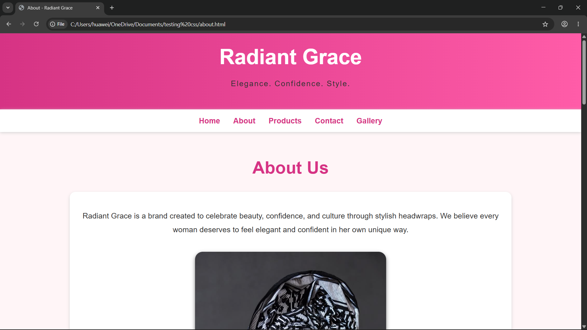
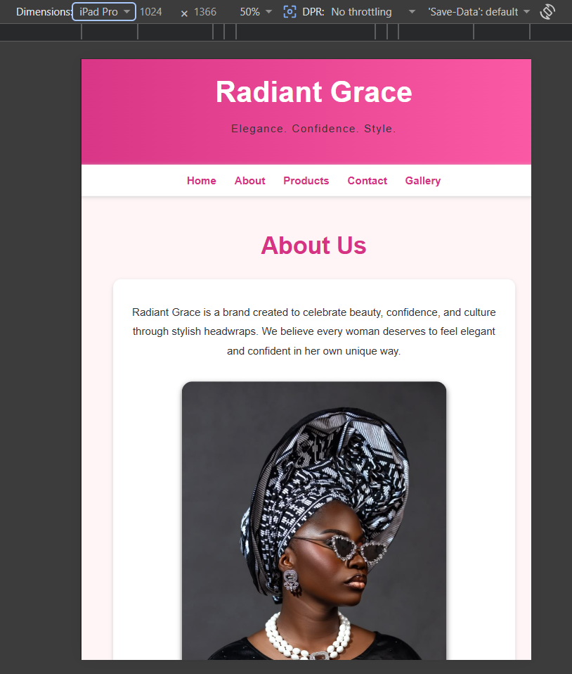
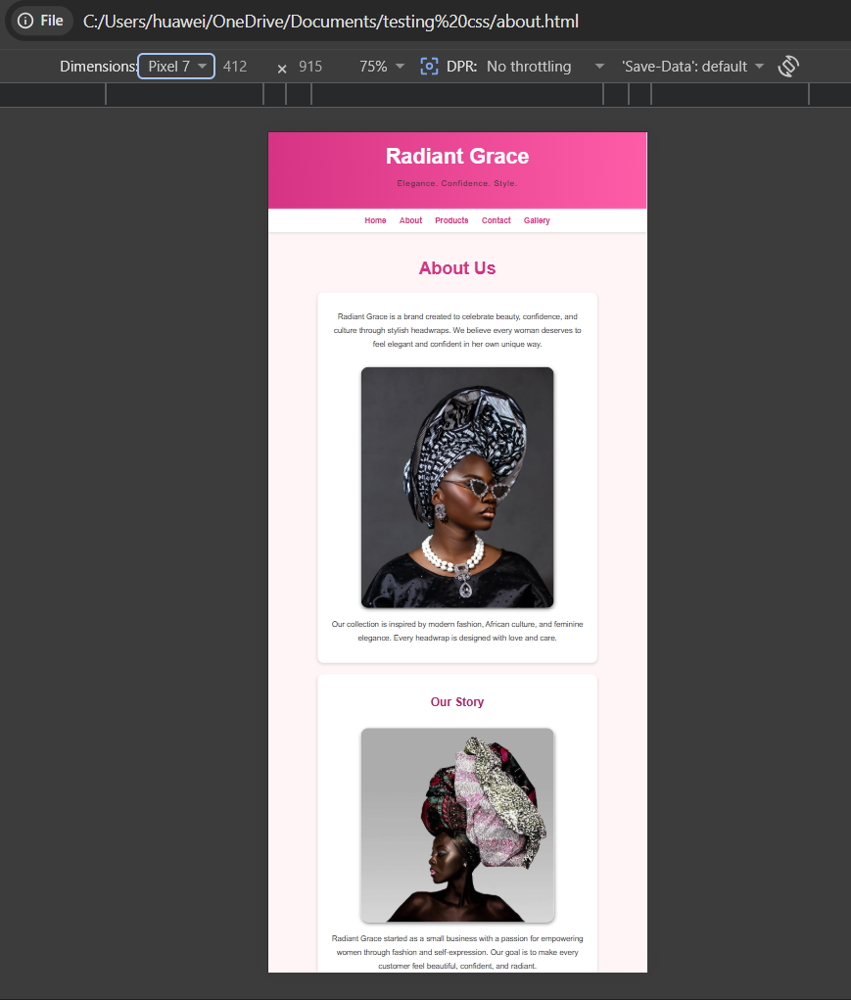
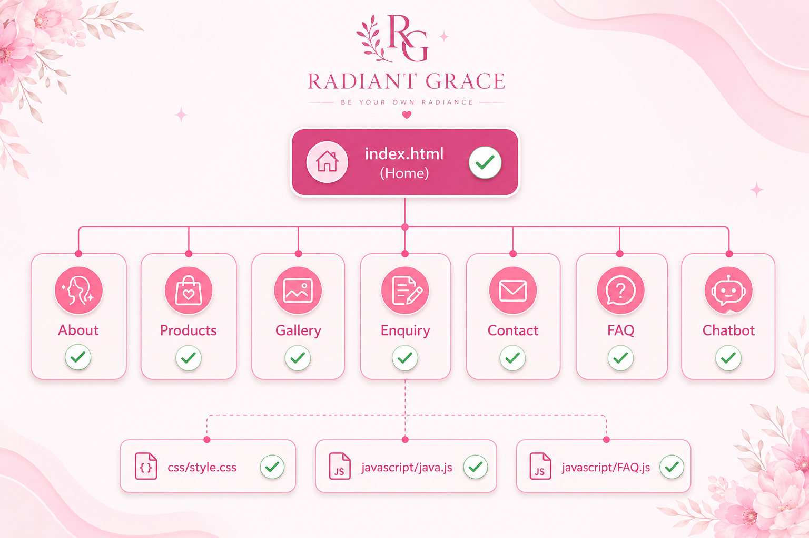

# Radiant Grace Website

## Project Overview

Radiant Grace is a headwrap and fashion accessories website created to showcase stylish products, share business information, display fashion inspiration images, and allow customers to contact or send enquiries to the business.

The website was designed with an elegant pink colour scheme to match the Radiant Grace brand identity: elegance, confidence, and style.

The project was developed using HTML5, CSS3, and JavaScript.

---

## Website Purpose

The purpose of the Radiant Grace website is to create an online presence for a headwrap and fashion accessories brand. It allows customers to learn about the brand, view products, browse a gallery, ask questions, and contact the business.

---

## Website Pages

## Home Page

The Home Page introduces the Radiant Grace brand and welcomes users to the website. It gives visitors a first impression of the business and provides access to the main website sections through the navigation menu.

## About Page

The About Page explains the Radiant Grace brand story, mission, vision, values, and inspiration. It gives customers more information about the purpose of the business and what the brand represents.

## Products Page

The Products Page displays the available headwrap products. Each product includes a description and price. The products are displayed using styled product cards to make the page neat and easy to read.

## Gallery Page

The Gallery Page displays product images and fashion inspiration photos. It allows customers to see how the headwraps and accessories can be styled.

## Enquiry Page

The Enquiry Page allows customers to send questions, order requests, or collaboration enquiries. The form was updated so that its input fields match the JavaScript validation requirements. This allows the form validation to work correctly.

## FAQ Page

The FAQ Page provides answers to common customer questions. It includes interactive questions and answers so users can click a question and view the answer.

## Contact Page

The Contact Page provides the business contact information, including email address, phone number, and location. Two map locations were added to the page: Johannesburg, South Africa, and Cape Town, South Africa.

## Chatbot Page

A chatbot page was also styled to match the main Radiant Grace website. It includes user and bot message areas, a message input section, send button, and suggestion buttons.

---

## Sitemap

The website includes the following pages in one project folder:

- Home Page
- About Page
- Products Page
- Gallery Page
- Enquiry Page
- FAQ Page
- Contact Page
- Chatbot Page

All pages are connected through the navigation menu.

---

## Project Folder Description

The project is organised in one main folder. This folder contains all website pages, the stylesheet, JavaScript file, images, and screenshots.

The main project folder includes:

- HTML pages for each website section
- A CSS file for styling the whole website
- A JavaScript file for interactivity and validation
- An images folder for website images
- A screenshots folder for desktop, tablet, and mobile screenshots
- A README file for project documentation

---

## Features

The Radiant Grace website includes the following features:

- Responsive website layout
- Navigation menu on all pages
- Stylish homepage design
- About page with brand information
- Product listings with descriptions and prices
- Product card layout
- Image gallery
- Contact page with business details
- Two embedded map locations
- Enquiry form
- JavaScript enquiry form validation
- FAQ page with interactive answers
- Chatbot page styling
- External CSS styling
- Consistent pink colour scheme
- Rounded images
- Box shadows for a modern look
- Hover effects on navigation links and buttons
- Mobile-friendly layout
- Tablet-friendly layout
- Desktop-friendly layout

---

## Styling and Design

The website uses a soft and elegant pink colour scheme. The design includes a gradient header and footer, white content boxes, rounded corners, and shadows.

The styling was applied using an external CSS file. The design was improved to make the website look more professional, modern, and consistent across all pages.

The chatbot styling was also updated so that it matches the same colour scheme and appearance as the rest of the website.

---

## Responsive Design

Responsive styling was added to make the website work on different screen sizes.

The website was designed to display correctly on:

- Desktop screens
- Tablet screens
- Mobile screens

On smaller screens, the navigation links stack vertically, images resize to fit the screen, forms become wider, and product cards display in a single column.

---

## JavaScript Functionality

JavaScript was added to improve website functionality.

The JavaScript is used for:

- Enquiry form validation
- Checking that users enter their name, email, and message
- FAQ dropdown functionality
- Chatbot interaction

The enquiry form was fixed by changing the form and input IDs so that they match what the JavaScript file expects.

---

## Updates Completed

Several improvements were made during the project:

- Created the homepage
- Added products page
- Added gallery page
- Added contact page
- Added about page
- Added enquiry page
- Added FAQ page
- Added chatbot page styling
- Added external CSS
- Added JavaScript file
- Added product images
- Added gallery images
- Added responsive styling
- Improved navigation
- Improved layout and spacing
- Improved colours and fonts
- Added hover effects
- Added form styling
- Added product card styling
- Added enquiry form validation
- Fixed enquiry form ID issues
- Added FAQ interactive functionality
- Added a second map location
- Updated chatbot design to match the main website
- Improved README documentation

---

## Changelog

## Part 1

## 10 May 2026

The GitHub repository was created and the first website structure was planned. The homepage was started, basic HTML structure was added, and navigation links were created between the pages.

## 14 May 2026

The Products page, Gallery page, and Contact page were added. Placeholder product images were included, page linking was improved, and footer sections were added to all pages.

## 18 May 2026

The image folder was added. Headwrap inspiration images and product descriptions were included. Page spacing and organisation were improved, and comments were added to the HTML files for readability.

---

## Part 2

## 22 May 2026

An external CSS stylesheet was created and connected to all HTML pages. Colour styling, fonts, navigation hover effects, button styling, form styling, and product section styling were added.

## 26 May 2026

The website layout was redesigned to look more elegant and professional. Box sections, product cards, a modern homepage design, rounded images, and shadows were added.

## 27 May 2026

The Gallery page layout was updated. More gallery images were added, and the page structure was improved using product-style cards. Page consistency was improved across the website.

## 28 May 2026

The README file was updated with project documentation, sitemap information, folder structure, references, semantic HTML information, future improvements, and author information.

---

## Part 3

## 30 May 2026

The Enquiry page was added. A customer enquiry form was created and linked to the JavaScript file. The form was fixed so that the form ID and input IDs matched the JavaScript validation requirements.

## 2 June 2026

The FAQ page was added. A question-and-answer layout was created, and JavaScript functionality was added so users can open and close answers.

## 5 June 2026

The Contact page was improved by adding business contact details and embedded map locations. A second location map was added for Cape Town, South Africa.

## 8 June 2026

Responsive CSS was added. The layout was improved for mobile and tablet screens. Navigation links, images, forms, product cards, and containers were adjusted for smaller screens.

## 10 June 2026

The chatbot page styling was added. The chatbot design was changed to match the Radiant Grace colour scheme and website layout.

---

## Version History

## Version 1.0

The first version included the GitHub repository, homepage, products page, gallery page, and contact page.

## Version 1.1

The image folder and website images were added. Navigation links and page styling were improved.

## Version 1.2

The CSS folder and external stylesheet were added. Layout, colours, and file structure were improved.

## Version 1.3

The About page was added with brand information, mission, vision, story, and values.

## Version 1.4

The Enquiry page was added. JavaScript form validation was included, and form ID issues were fixed.

## Version 1.5

The FAQ page was added with interactive functionality. Responsive CSS was also added.

## Version 1.6

A second map location was added to the Contact page. Chatbot styling was added and the README documentation was improved.

---

## Semantic HTML

The website uses semantic HTML to improve structure and readability.

The main semantic sections used include:

- Header
- Navigation
- Main content
- Sections
- Footer

These sections make the website easier to understand and maintain.

---

## Future Improvements

Possible future improvements include:

- Add online shopping cart functionality
- Add secure online payments
- Add customer reviews
- Add social media links
- Add newsletter signup
- Improve chatbot responses
- Add product search
- Add product filtering
- Add animations
- Improve accessibility
- Connect the contact form to email
- Add more product categories

---

## Deployment link 

https://usernamekay44.github.io/FINAL-POE-main-katlehokhabele/ 

# Website Screenshots

## Conclusion
The Radiant Grace website will support the brand by creating a modern and user-friendly online platform. It will include all important pages, product information, enquiry features, contact details, FAQ interaction, chatbot styling, and responsive design. This project will help Radiant Grace grow its visibility and present its products professionally online
# Site Map 

## References
Adobe. (2026). Adobe Color: Colour wheel and palette generator. Available at: https://color.adobe.com/ (Accessed: 19 June 2026).

Canva. (2026). Canva: Graphic design platform used for creating website visuals, banners and design elements. Available at: https://www.canva.com/ (Accessed: 19 June 2026).

Coolors. (2026). Coolors: Colour palette inspiration and generator. Available at: https://coolors.co/ (Accessed: 19 June 2026).

Font Awesome. (2026). Font Awesome: Icons used for website icons and user interface elements. Available at: https://fontawesome.com/ (Accessed: 19 June 2026).

GitHub. (2026). GitHub: Code hosting platform for version control and collaboration. Available at: https://github.com/ (Accessed: 19 June 2026).

Google. (2026). Google Maps Embed: Used for embedding business locations on the contact page. Available at: https://www.google.com/maps (Accessed: 19 June 2026).

Google Fonts. (2026). Google Fonts: Web fonts used for website typography. Available at: https://fonts.google.com/ (Accessed: 19 June 2026).

Google. (2026). Material Symbols and Icons: Open-source icon library. Available at: https://fonts.google.com/icons (Accessed: 19 June 2026).

MDN Web Docs. (2026). MDN Web Docs: HTML, CSS and JavaScript documentation and learning resources. Available at: https://developer.mozilla.org/ (Accessed: 19 June 2026).

Microsoft. (2026). Visual Studio Code: Source-code editor used for developing the Radiant Grace website. Available at: https://code.visualstudio.com/ (Accessed: 19 June 2026).

OpenAI. (2026). ChatGPT (GPT-5.5): Artificial intelligence assistant used for website planning, content development, code support and sitemap generation. Available at: https://chat.openai.com/ (Accessed: 19 June 2026).

Pexels. (2026). Pexels: Free stock photographs and images used for website galleries and visual content. Available at: https://www.pexels.com/ (Accessed: 19 June 2026).

Pinterest. (2026). Pinterest: Fashion, headwrap, colour, and layout inspiration used during the website design process. Available at: https://www.pinterest.com/ (Accessed: 19 June 2026).

Unsplash. (2026). Unsplash: Free high-resolution photographs used for website imagery. Available at: https://unsplash.com/ (Accessed: 19 June 2026).

W3Schools. (2026). W3Schools: HTML, CSS and JavaScript tutorials and examples. Available at: https://www.w3schools.com/ (Accessed: 19 June 2026).

World Wide Web Consortium (W3C). (2026). W3C: HTML and CSS standards and validation resources. Available at: https://www.w3.org/ (Accessed: 19 June 2026).

